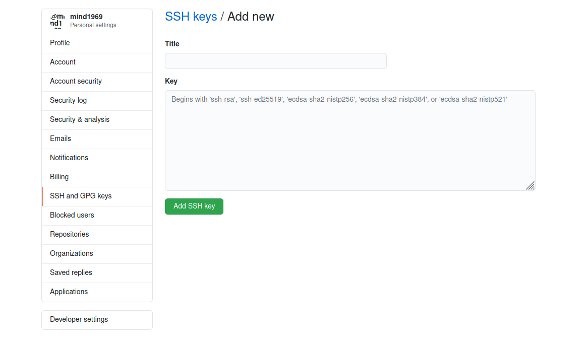

# 本地上传文件到github上
## 1.生成ssh密钥
```
ssh-keygen -t rsa -C "2026002938@qq.com"
```
上述命令会默认在当前目录下新建一个.ssh文件夹，里面会生成id_rsa和id_rsa.pub两个文件来保存ssh-key。  

## 2.添加ssh-key到github上
在github帐号的setting中的SSH and GPG keys中添加ssh-key  


## 3.测试是否可行
```
ssh -T git@github.com
```

## 4.在Linux上传文件到GitHub
1.在github上创建一个仓库，例如：studynote
2.在linux上，安装git： sudo pacman -S git  
3.创建文件
4.输入github帐号
```
git config --global user.name "XXXX"
git config --global user.email "XXXX@XXX"
```
5.创建git目录
新建目录  例如：note,然后执行如下命令：
```
//将当前目录变成git仓库
git init
//添加文件到版本库里
git add .      //添加所有
git add [具体文件名]
//将文件提交到git上
git commit -m "提交说明"
//将本地和github上的库关联起来   输入github帐号和密码
$ git remote add origin git@github.com/mind1969/studynote.git
//上传文件到github上
git push origin master
```


## 5.Git操作教程
